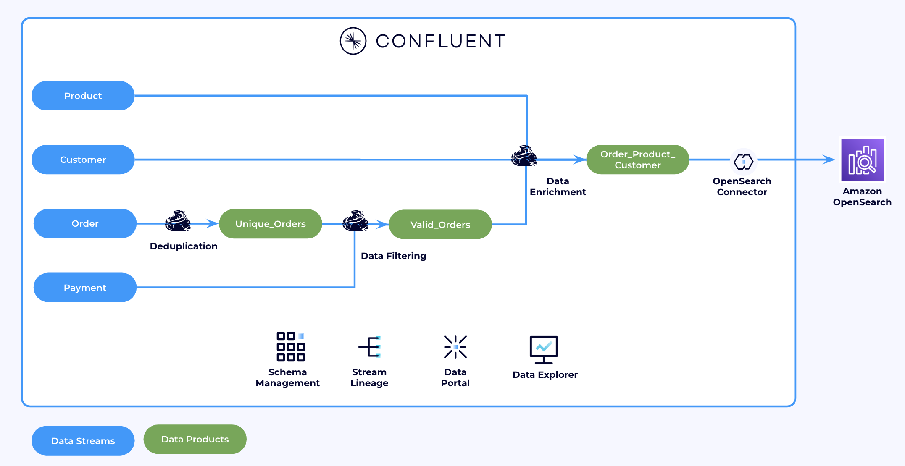

# Real-Time Data Processing with Confluent Cloud

This is a complete end-to-end demo showcasing the power of the Confluent Cloud Data Streaming Platform (DSP). It focuses on a third-party reseller that offers products from major vendors like Amazon and Walmart.

The demo illustrates how Confluent Cloud can be used to filter, enrich, and transform online orders in real time. Additionally, it demonstrates seamless integration with existing systems, specifically Amazon OpenSearch.



## General Requirements

* **Confluent Cloud API Keys** - [Cloud resource management API Keys](https://docs.confluent.io/cloud/current/security/authenticate/workload-identities/service-accounts/api-keys/overview.html#resource-scopes) with Organisation Admin permissions
* **Terraform (v1.9.5+)** - The demo resources is automatically created using [Terraform](https://www.terraform.io).
* **Git CLI** - Git CLI to clone the repo 

<details>
<summary>Installing CLI tools on MAC</summary>

Install `git` and `terraform` by running:

```bash
brew install git terraform
```


</details>


<details>
<summary>Installing CLI tools on Windows</summary>

Install `git` and `terraform` by running:

```powershell
winget install --id Git.Git -e
winget install --id Hashicorp.Terraform -e
```

</details> 


## Setup

<details>
<summary>Mac Setup</summary>

First, clone the repo and change directory to `demo-infrastructure`

```bash
git clone https://github.com/AhmedsZamzam/getting-started-flink-cc.git
cd flink-cc-demo/demo-infrastructure
```

In Finder, navigate to the `demo-infrastructure` directory and open the `terraform.tfvars` file for editing. Replace the placeholders with your own API keys and name.

For example, if your `confluent_cloud_api_key` is `ABCDEFG`, your c`onfluent_cloud_api_secret` is `123456789ABDCEFGHLJKLMNOP=7-23`, and your name is `Kevin`, your file should look like this:
```
confluent_cloud_api_key = "ABCDEFG"
confluent_cloud_api_secret = "123456789ABDCEFGHLJKLMNOP=7-23"
prefix = "kevin"
```

In `demo-infrastructure` run the following commands to set up the whole demo environment

```bash
terraform init
terraform apply --auto-approve
```

</details>

<details>
<summary>Windows Setup</summary>

First, clone the repo and change directory to `demo-infrastructure`

```bash
git clone https://github.com/AhmedsZamzam/getting-started-flink-cc.git
cd flink-cc-demo\demo-infrastructure
```

In File explorer, navigate to the `demo-infrastructure` directory and open the `terraform.tfvars` file for editing. Replace the placeholders with your own API keys and name.

For example, if your `confluent_cloud_api_key` is `ABCDEFG`, your c`onfluent_cloud_api_secret` is `123456789ABDCEFGHLJKLMNOP=7-23`, and your name is `Kevin`, your file should look like this:

```
confluent_cloud_api_key = "ABCDEFG"
confluent_cloud_api_secret = "123456789ABDCEFGHLJKLMNOP=7-23"
prefix = "kevin"
```

In `demo-infrastructure` run the following commands to set up the whole demo environment

```bash
terraform init
terraform apply --auto-approve
```

</details>

## Labs

> NOTE: GO TO LAB1 ON THE ACTUAL WORKSHOP DAY

**Next Lab:** [Lab 1: Getting Started with Flink](./flink-getting-started/lab1.md)


## Tear down

> NOTE: TEARDOWN AFTER YOU COMPLETED THE WORKSHOP

In `demo-infrastructure` run the following commands to destroy the whole demo environment

```bash
terraform destroy --auto-approve
```
