# Lab 1

This lab centers on a third-party reseller that offers products from major vendors like Amazon and Walmart. Throughout the lab, we will explore various data sources and develop ad-hoc queries to aggregate the data effectively.

We'll join order data with customer and product data, then sink the resulting dataset into an Amazon OpenSearch domain.


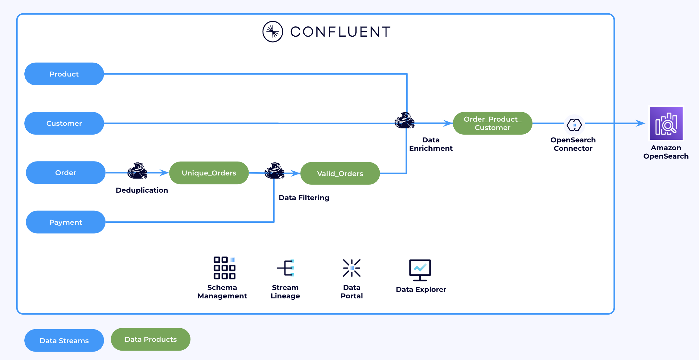

## Prerequisites

All required resources in Confluent Cloud must be already created for this lab to work correctly. If you haven't already, please follow the [Demo environment setup](../README.md).

## Content of Lab 1

[1. Verify Confluent Cloud Resources](lab1.md#1-verify-confluent-cloud-resources)

[2. Connecting to Flink](lab1.md#2-connecting-to-flink)

[3. Tables](lab1.md#3-tables)

[4. Deduplication](lab1.md#4-deduplication)

[5. Flink Joins](lab1.md#5-flink-joins)

[6. Data Enrichment](lab1.md#6-data-enrichment)

[7. Sink Connectors](lab1.md#7-sink-connectors)

[8. Stream Lineage](lab1.md#8-stream-lineage)


## 1. Verify Confluent Cloud Resources
Let's verify if all resources were created correctly and we can start using them.

### Kafka Topics

In [Confluent Cloud Cluster UI](https://confluent.cloud/go/clusters), pick your environment (that starts with your intials) and click on the `marketplace` cluster. Check if the following topics exist in your Confluent cluster:

- **`clicks`**: Tracks customer clicks, including product and action details.  
- **`customers`**: Contains customer data (Customer CRM)
- **`customer_inquiries`**: Contains customer inquiries associated with Orders.  
- **`order_status`**: Represents the status of each order with the following possible values: `CREATED`, `PAID`, `SHIPPED`, and `DELIVERED`.  
- **`orders`**: Logs real-time order transactions (Billing System).  
- **`payments`**: Records all payments made, associated with specific orders.  
- **`products`**: Stores product data (Product Catalog).  


### Flink Compute Pool

Confluent Cloud Flink Compute Pool is a managed environment that provides the resources needed to run Apache Flink jobs directly within Confluent Cloud. It eliminates the need for self-managed Flink clusters by offering a scalable, serverless compute layer for stream processing and real-time analytics on data in Confluent topics.

With Compute Pools, you don't need to manually size your workload. Simply select the maximum number of Confluent Flink Units (CFUs), and Confluent will automatically scale your resources. You are only charged for the CFUs consumed by your queries.

In [Flink UI](https://confluent.cloud/go/flink), choose the Environment and check if there are two pools created:

- **`data-generation`**: Contains the Flink statements used to generate the lab data.  
- **`default`**: the pool we will use to run the ad-hoc queries in this lab.

  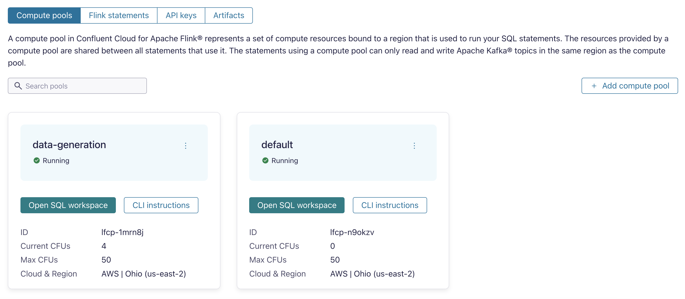

<details> 
<summary>[OPTIONAL] Creating a Flink Compute Pool</summary>

The Flink pools that we will use were created by terraform, you can also create them manually through the UI.

In the Confluent environment `<prefix>-prod-<random_id>`, choose the `Flink` Tab. From there we create a new compute pool:
* choose a cloud region, click `continue` and 
* enter Pool Name: `cc_flink_compute_pool` with 10 Confluent Flink Units (CFU) and 
* click `Continue` button and then `Finish`.
  
The pool will be provisioned and ready to use in a couple of moments.
AWS Pools take 1-2 minutes. Azure Pools can take 5-7 minutes.

</details>


## 2. Connecting to Flink 
You can use your web browser or SQL shell to enter Flink SQL statements. On the same page, click on `Open SQL Workspace` for the `default` pool.


    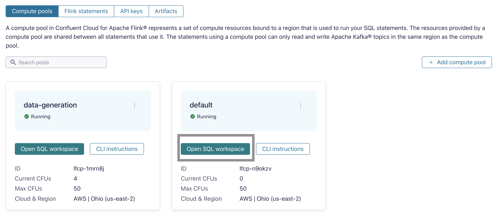


## 3. Tables
Let's start with exploring our tables.
Kafka topics and schemas are always in sync with the metadata in Flink's catalog. Any topic created in Kafka is visible directly as a table in Flink, and any table created via Flink is backed by a topic in Kafka. Effectively, Flink provides a SQL interface on top of Confluent Cloud.

Following mappings exist:
| Kafka          | Flink     | 
| ------------   |:---------:|
| Environment    | Catalog   | 
| Cluster        | Database  |
| Topic + Schema | Table     |

We will now work in the default SQL Workpace using `default` Flink Compute Pool:


Make sure you set with the right default  catalog (=environment) and database (=`marketplace`).

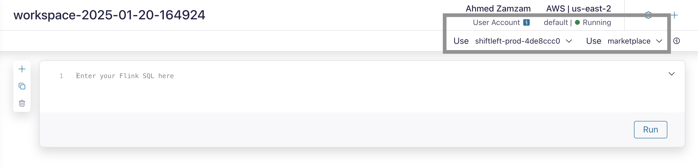


List all tables (=Kafka topics) in this database (=Kafka Cluster), by pasting the below in the first cell:
```
SHOW TABLES;
```
Do you see tables `clicks`,`customers`,`order_status`,`orders`,`payments`,`customer_inquiries` and `products`

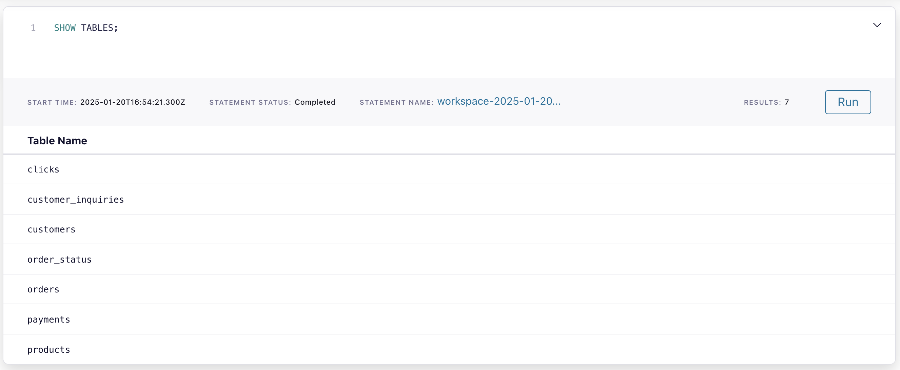

You can add more Workspace cells by clicking the `+` button on the left.


Understand how the table `products` was created:
```
SHOW CREATE TABLE products;
```

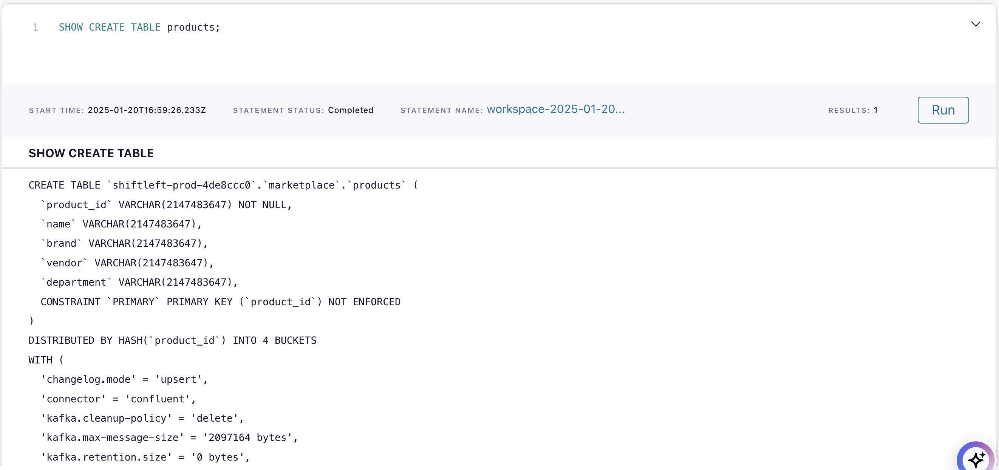

You can find more information about all parameters  [here.](https://docs.confluent.io/cloud/current/flink/reference/statements/create-table.html)

### 4. Deduplication

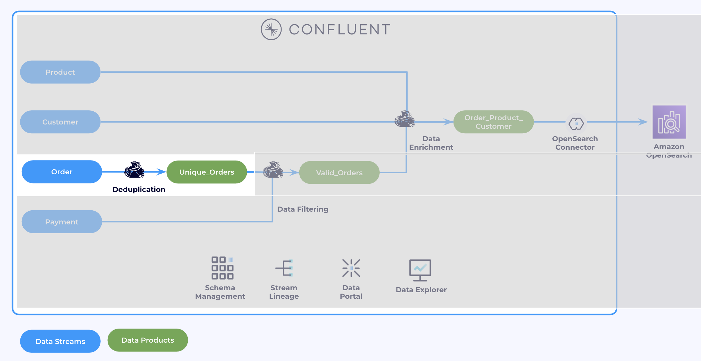

Let’s take a closer look at the orders. 

```sql
SELECT * FROM orders;
```

We need to make sure that there are no duplicated in the orders stream. We do not want to process an order twice. Let's check if we have any duplicates.

```sql
SELECT order_id, COUNT(*) FROM orders GROUP BY order_id;
```
The above Flink query counts the number of rows for each unique `order_id` in the `orders` table. The output shows that several `order_id` values appear more than once, indicating duplicates in the table. Let’s address this issue.

```sql
SELECT 
  order_id, 
  product_id, 
  customer_id, 
  price
FROM (
   SELECT * ,
          ROW_NUMBER() OVER (PARTITION BY order_id ORDER BY `$rowtime` ASC) AS rownum
   FROM orders
      )
WHERE rownum = 1;
```

 We can double-check that there are no duplicates anymore via:

```sql
SELECT order_id, COUNT(*) FROM 
(
  SELECT 
    order_id, 
    product_id, 
    customer_id, 
    price
  FROM (
    SELECT * ,
            ROW_NUMBER() OVER (PARTITION BY order_id ORDER BY `$rowtime` ASC) AS rownum
    FROM orders
        )
  WHERE rownum = 1
)
GROUP BY order_id;
```

This seems to work. Let’s materialize the result. (Alternative, you can also use the “Deduplicate” Flink Actions.)

```sql
SET 'client.statement-name' = 'unique-orders-maintenance';
SET 'sql.state-ttl' = '1 hour';

CREATE TABLE unique_orders 
AS SELECT 
  order_id, 
  product_id, 
  customer_id, 
  price
FROM (
   SELECT * ,
          ROW_NUMBER() OVER (PARTITION BY order_id ORDER BY `$rowtime` ASC) AS rownum
   FROM orders
      )
WHERE rownum = 1;
```

Now let's check the `unique_orders` table definition

```sql
SHOW CREATE TABLE unique_orders;
```

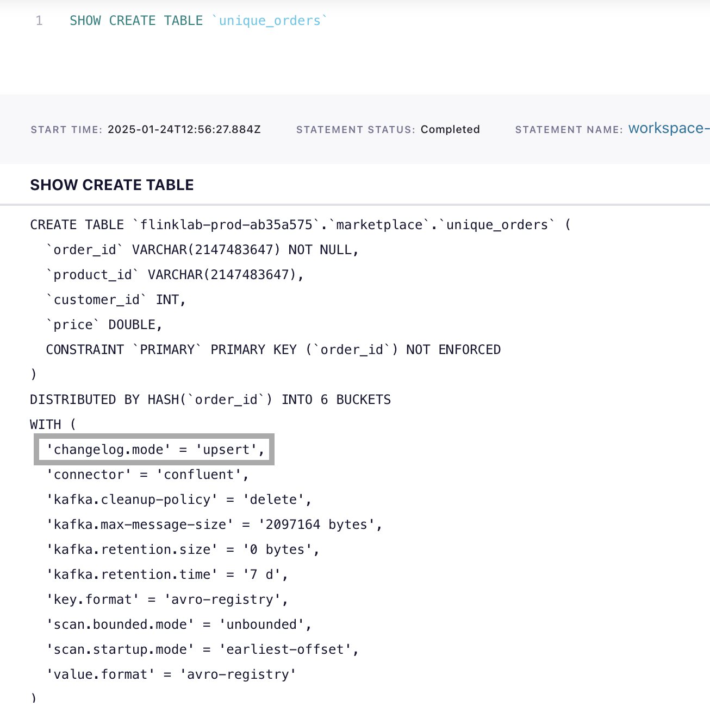

Changelog mode `upsert` means that the messages in the underlying Kafka topic are interpreted as `upserts` based on the message's key. For a given Kafka message if no row with the same key exists, it's an insertion. If a row with the same key already exists, its an update.

Here's Flink was not smart enough to infer, that `unique_orders` in reality never receives any updates. We will therefore explicitly configure `unique_orders` to be append only. This will allow additional query types downstream, because some SQL operators do not support updating tables as inputs.


```sql
ALTER TABLE `unique_orders` SET ('changelog.mode' = 'append');
```

* `append` mode means only new rows (inserts) are added to the table. There are no updates or deletes processed.


> NOTE: You can find more information about changelog mode [here.](https://docs.confluent.io/cloud/current/flink/concepts/dynamic-tables.html#changelog-entries)

We will now use the newly created table `unique_orders` throughout the workshop.

### 5. Flink Joins

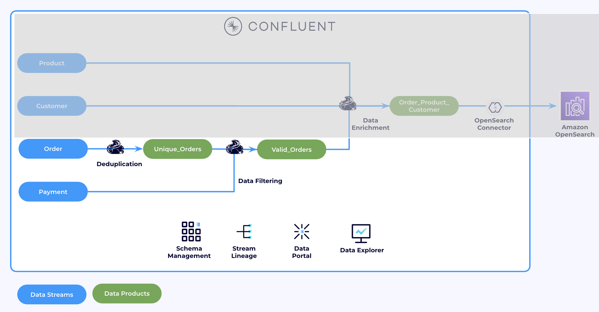

Flink SQL supports complex and flexible join operations over dynamic tables. There are a number of different types of joins to account for the wide variety of semantics that queries may require.

> You can find more information about Flink SQL Joins [here.](https://docs.confluent.io/cloud/current/flink/reference/queries/joins.html)

We can look at the different types of joins available. 
We will join `unique_orders` records and `customer` records.

Join `unique_orders` with `customer` records (regular inner join). We will pick one customer as an example, in this case it is customer with `customer_id=3001`:

```sql
SELECT /*+ STATE_TTL('unique_orders'='6h', 'customers'='2d') */ 
order_id, unique_orders.`$rowtime`, email
FROM unique_orders
INNER JOIN customers 
ON unique_orders.customer_id = customers.customer_id
WHERE unique_orders.customer_id = 3001;
```

Notice how all output rows update whenever the customer's email changes. This is expected behavior with a regular join as it doesn't have any notion of time. Like in a database, the output of a join changes for all matching rows if any of the sides of joins changes. In the context of streaming, this approach has two key disadvantages:

1. If the cardinality of one of the tables is infinity (like `orders`), the state of the join will grow indefinitely. In this case, you need a state time-to-tive (state-ttl) so that Flink can clean up state eventually.
2. Often you are looking for different join semantics, where every order is joined to the product information as of the time when the order happened and orders are never updated afterwards when the product information changes. 

 >Look at Time-to-live to limit the state size [here.](https://docs.confluent.io/cloud/current/flink/operate-and-deploy/best-practices.html#implement-state-time-to-live-ttl)
TTL Hints configuraiton examples [More info here.](https://docs.confluent.io/cloud/current/flink/reference/statements/hints.html)


A temporal join address both of these concerns, which links orders to customer records as they existed at the time when the order was created. We will do the same, use the same `customer_id=3001`. While keeping the previous cell,nn a new cell run this temporal join:

```sql
SELECT order_id, unique_orders.`$rowtime`, email
FROM unique_orders
INNER JOIN customers FOR SYSTEM_TIME AS OF unique_orders.`$rowtime`
ON unique_orders.customer_id = customers.customer_id
WHERE unique_orders.customer_id = 3001;
```

Notice that whenever a customer updates their email, previous orders remain unchanged. This behavior occurs because the join is performed based on the state of the data at the time the order was placed. In the example below, when the customer updates their email from `king.okuneva@yahoo.com` to `johnny.kling@gmail`.com, earlier orders retain the original email. This ensures that orders are enriched with the customer's information as it was at the time of the order, which is the desired outcome. Therefore,**Temporal Joins** are better in for this use case.

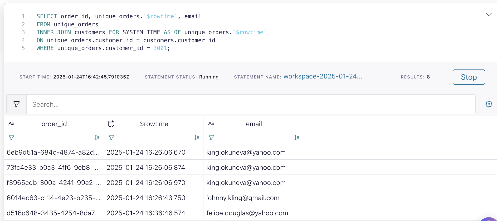

> *Note: In real-world scenarios, customer email addresses rarely change. This update is being made for demonstration purposes.*

> NOTE: You can find more information about Temporal Joins with Flink SQL [here.](https://docs.confluent.io/cloud/current/flink/reference/queries/joins.html#temporal-joins)

#### Interval Joins

Interval joins are particularly useful when working with unbounded data streams. In our use case, an order is considered valid only if a corresponding payment is received. Since payments always occur after an order is placed, interval joins allow us to efficiently match orders with their respective payments based on time constraints.

Create a new table that will hold valid orders.

```sql
SET 'client.statement-name' = 'valid-orders-materializer';
CREATE TABLE valid_orders (
  order_id STRING,
  customer_id INT,
  product_id STRING,
  order_time TIMESTAMP_LTZ(3),
  payment_time TIMESTAMP_LTZ(3),
  amount DECIMAL,
  WATERMARK FOR order_time AS order_time - INTERVAL '5' SECOND
) AS SELECT unique_orders.order_id, customer_id, product_id, unique_orders.`$rowtime` AS order_time, payment_time, amount
FROM unique_orders
INNER JOIN payments
ON unique_orders.order_id = payments.order_id
WHERE unique_orders.`$rowtime` BETWEEN payment_time - INTERVAL '10' MINUTES AND payment_time;
```

Here we are using [CREATE TABLE AS SELECT(CTAS)](https://docs.confluent.io/cloud/current/flink/reference/statements/create-table.html#create-table-as-select-ctas) statement. Similar to `INSERT INTO AS SELECT`, CTAS statements run continuously, writing the output of the `SELECT` query into the newly created table, `valid_orders`.

Checkout records in `valid_orders`
```sql
SELECT * FROM valid_orders;
```

We will now use `valid_orders` for the rest of the workshop.

### 6. Data Enrichment

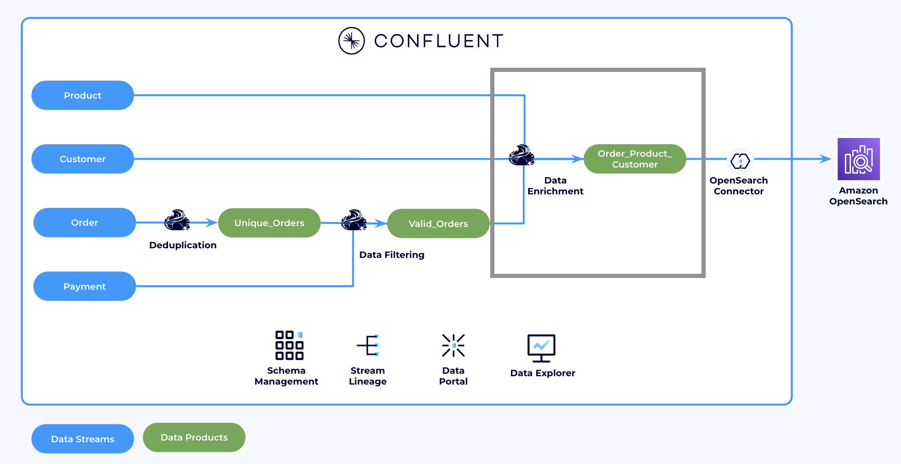
 
We will join data from: Valid Orders, Customer, Product tables together in a single SQL statement. And insert them into a new data product: `order_customer_product`

Use CTAS to create a new table for `Order <-> Customer <-> Product` join results

```sql
SET 'client.statement-name' = 'valid-orders-customer-product-materializer';
CREATE TABLE order_customer_product(
  order_id STRING,
  customer_id INT,
  name STRING,
  email STRING,
  brand STRING,
  product STRING,
  sale_price DOUBLE
)WITH (
    'changelog.mode' = 'retract'
)AS SELECT
  valid_orders.order_id,
  valid_orders.customer_id,
  customers.name,
  customers.email,
  products.brand,
  products.name AS product,
  valid_orders.amount
FROM valid_orders
  INNER JOIN customers FOR SYSTEM_TIME AS OF valid_orders.order_time
    ON valid_orders.customer_id = customers.customer_id
  INNER JOIN products FOR SYSTEM_TIME AS OF valid_orders.order_time
    ON valid_orders.product_id = products.product_id;
```

In this case, we used a temporal join to associate valid orders (orders with a successful payment) with product and customer information at the time the order was placed. A regular join is not suitable here because it would generate a new output for all orders every time the customer or product information changes. Since we are only interested in the product and customer details as they were at the time of the order, temporal joins are the ideal solution.

Verify that the data was joined successfully. 
```sql
SELECT * FROM order_customer_product;
```

**We have now created a new data product `order_customer_product` from an existing data product `valid_orders`. This is the power data portability.**

### 7. Sink Connectors

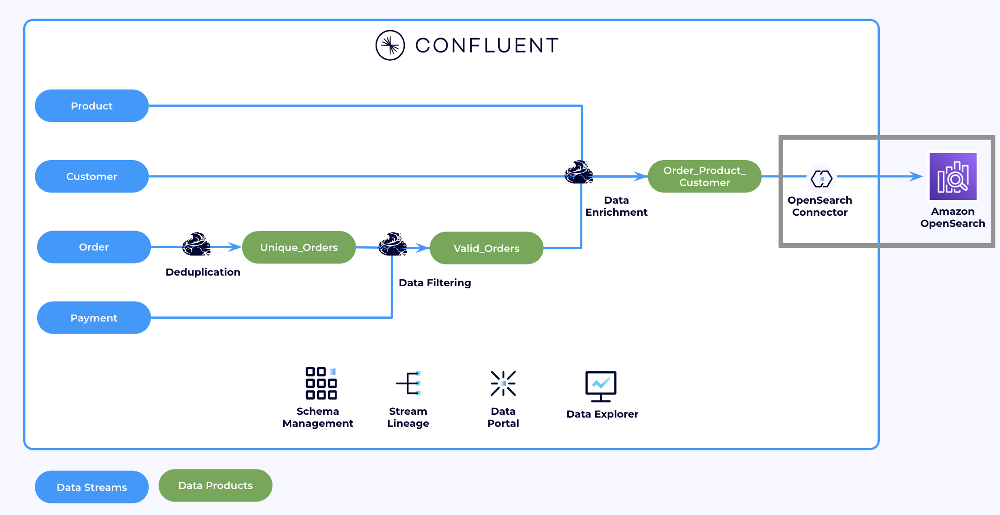

Let's sink this data product to Amazon S3:

1. In [Confluent Cloud Connectors UI](https://confluent.cloud/go/connectors), choose your environment and your cluster as `marketplace` and click **Continue**.
2. Search and select ** Opensearch Sink**
3. Choose the `order_customer_product` topic, then click **Continue**
4. For Kafka Credentials, choose **My account** and **Generate API Key and Download**. Click **Continue**.
5. For Authentication:
   1. OpenSearch URL, Username and password will be given on the day.
6. For Configuration:
   1. Input Kafka record value format: **Avro**
   2. Number of Indexes: **1**
   3. Index 1 Configuration:
      1. Index: `<your_name>_order_customer_product`
      > NOTEL IT IS REALLY IMPORTANT TO REPLACE <your_name> WITH YOUR NAME.
      2. Topic: `order_customer_product`
   4. Click **Continue**
  
    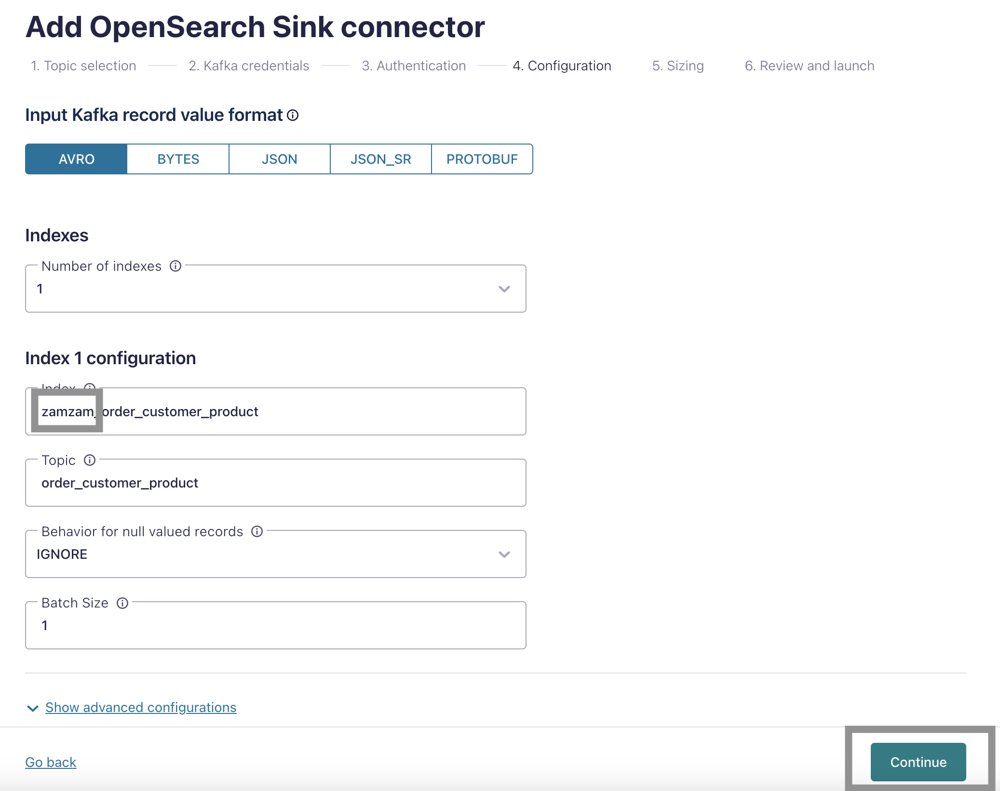

  5. Follow through the rest of the wizard and keep the defaults.
  6. In a couple, of minutes you should see the conenctor in **Running** state.

  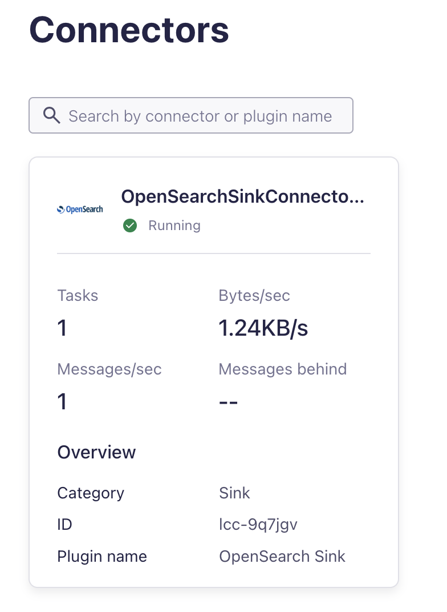


### 8. Stream Lineage

Congratulations on building your first use-case on top of our data product. Let's checkout what we have built.

In the [Conflluent Cloud Cluster UI](https://confluent.cloud/go/clusters), choose the **Environment** and **Cluster**, then navigate to the left-hand pane and click on **Stream Lineage**.

   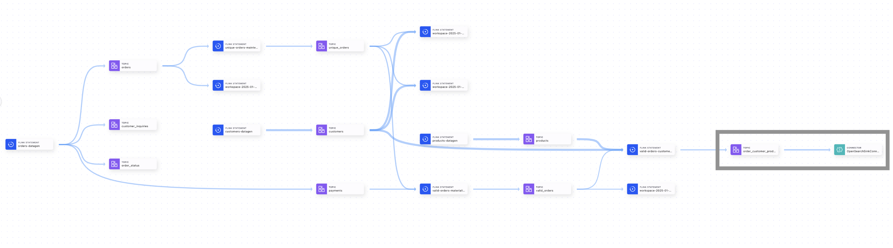

At the end of the pipeline, you should see the data product `order_customer_product` and the OpenSearch Sink Connector that you just created.

## End of Lab.

# If you don't need your infrastructure anymore, do not forget to delete the resources!
Before destroy the entire infrastructure, first delete the connector created in this Lab.

1. In [Confluent Cloud Connectors UI](https://confluent.cloud/go/connectors), choose your environment and your cluster as `marketplace` and click **Continue**.
2. Click on the connector you created.
3. In the **Settings** tab, click **Delete Connector**

   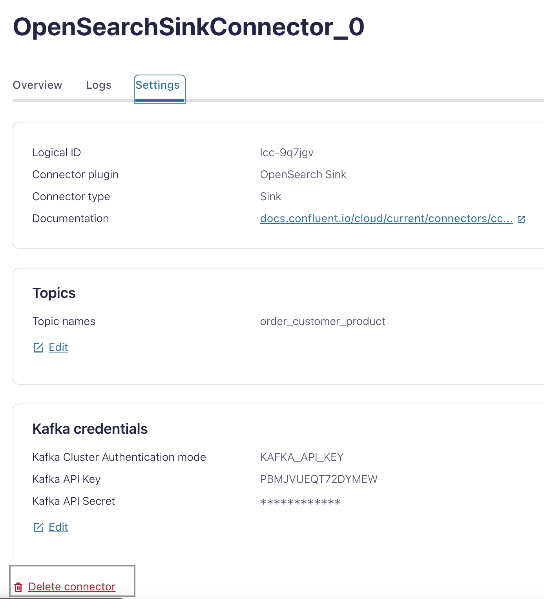

4. Enter the connector name and click **Confirm**
5. **Now you are read to delete the demo environment. Go to [destroy lab](../README.md#tear-down).**
